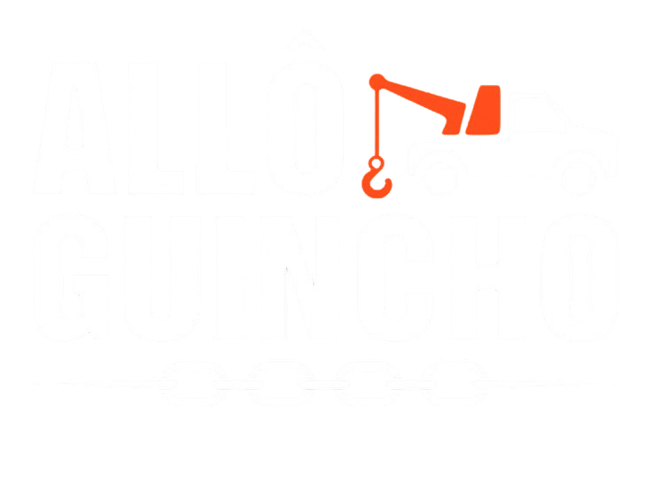

# Allô Guincho - Website Oficial (Landing Page)



Website oficial da **Allô Guincho**, empresa especializada em serviços de reboque 24h na Grande São Paulo, interior e litoral paulista.

## 🚀 Sobre o Projeto

Landing page institucional desenvolvida em React + TypeScript com foco em conversão e socorro emergencial 24h. Oferece solicitação direta de guincho e orçamento rápido via WhatsApp.

## 🛠️ Tecnologias Utilizadas

- **Frontend**: React 18 + TypeScript
- **Build Tool**: Vite
- **Styling**: Tailwind CSS + Radix UI
- **Icons**: Lucide React

## 🚀 Como Executar

### Instalação

```bash
# Instale as dependências
npm install

# Execute em modo desenvolvimento
npm run dev

# Build para produção
npm run build
```

## 📁 Estrutura do Projeto

```
allo-guincho/
├── public/
│   ├── robots.txt
│   ├── sitemap.xml
│   └── logo-allo-guincho-branca.ico
├── src/
│   ├── assets/
│   │   ├── logo-allo-guincho.png
│   │   └── logo-allo-guincho-branca.png
│   ├── components/
│   │   ├── sections/
│   │   │   ├── HeroSection.tsx
│   │   │   ├── ServicesSection.tsx
│   │   │   ├── FleetGallery.tsx
│   │   │   ├── WhyUsSection.tsx
│   │   │   ├── AboutSection.tsx
│   │   │   ├── TestimonialsSection.tsx
│   │   │   ├── FaqSection.tsx
│   │   │   └── CoverageSection.tsx
│   │   ├── ui/
│   │   │   ├── accordion.tsx
│   │   │   └── button.tsx
│   │   ├── DispatchWidget.tsx
│   │   ├── Header.tsx
│   │   ├── Footer.tsx
│   │   └── WhatsAppButton.tsx
│   ├── config/
│   │   └── contact.ts
│   ├── lib/
│   │   └── utils.ts
│   ├── App.tsx
│   ├── Home.tsx
│   ├── main.tsx
│   └── index.css
├── index.html
├── package.json
└── README.md
```

## 📞 Configuração de Contato

As informações de contato estão centralizadas em `src/config/contact.ts`:

```typescript
export const CONTACT_CONFIG = {
  phone: {
    display: "(11) 95820-4216",
    link: "+5511958204216",
    whatsapp: "5511958204216",
  },
};
```

## 📝 Licença

Este projeto é propriedade da **Allô Guincho**. Todos os direitos reservados.
